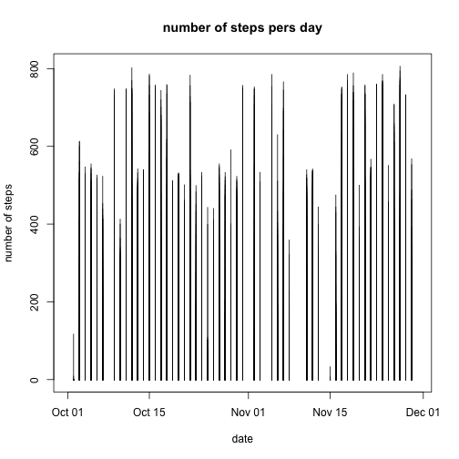
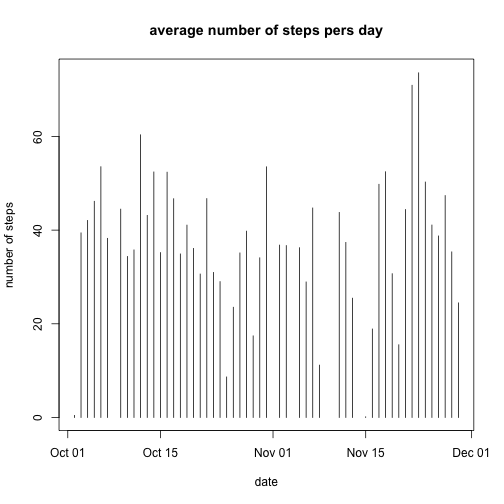
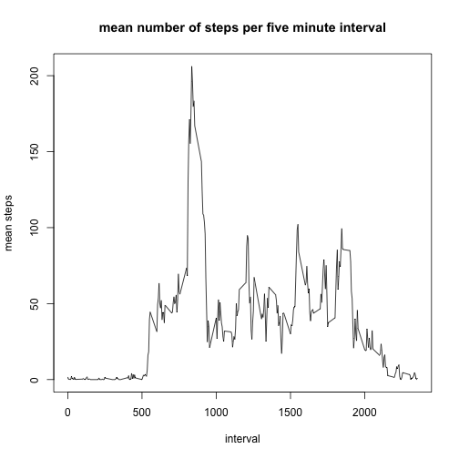
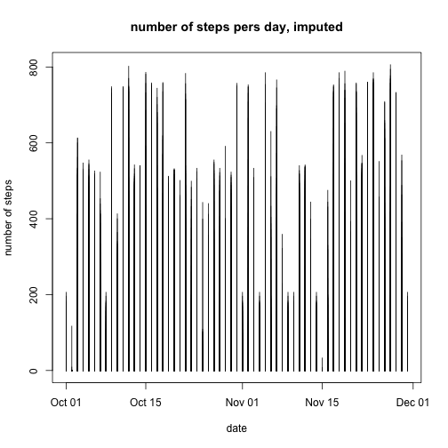
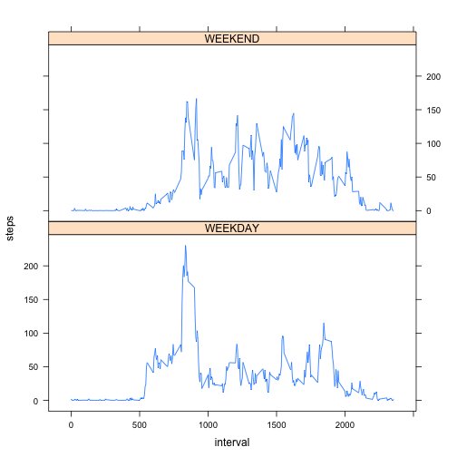

# Reproducible Research: Peer Assessment 1

## Overview

It is now possible to collect a large amount of data about personal movement using activity monitoring devices such as a Fitbit, Nike Fuelband, or Jawbone Up. These type of devices are part of the “quantified self” movement – a group of enthusiasts who take measurements about themselves regularly to improve their health, to find patterns in their behavior, or because they are tech geeks. But these data remain under-utilized both because the raw data are hard to obtain and there is a lack of statistical methods and software for processing and interpreting the data.

This assignment makes use of data from a personal activity monitoring device. This device collects data at 5 minute intervals through out the day. The data consists of two months of data from an anonymous individual collected during the months of October and November, 2012 and include the number of steps taken in 5 minute intervals each day.

## Preparation: Loading and preprocessing the data

The variables included in this dataset are:

* steps: Number of steps taking in a 5-minute interval (missing values are coded as NA)
* date: The date on which the measurement was taken in YYYY-MM-DD format
* interval: Identifier for the 5-minute interval in which measurement was taken. Within each day in the data set, there are 288 measurements. The format of each interval reading is the hour (24 hr format) followed by the starting minute of the interval, with no other characters. For instance 135 would be 1:35 AM, and 255 would be followed by 300 in the data set.

The dataset is stored in a comma-separated-value (CSV) file and there are a total of 17,568 observations in this dataset.

The data was loaded from the file activity.csv located within this project. It is assumed that the working 
directory is properly set when executing this analysis. Within the data set, there are many NA step values.

```r
activityDf <- read.csv("./activity.csv", colClasses=c("numeric","Date","numeric"))
summary(activityDf)
```

```
##      steps            date               interval   
##  Min.   :  0.0   Min.   :2012-10-01   Min.   :   0  
##  1st Qu.:  0.0   1st Qu.:2012-10-16   1st Qu.: 589  
##  Median :  0.0   Median :2012-10-31   Median :1178  
##  Mean   : 37.4   Mean   :2012-10-31   Mean   :1178  
##  3rd Qu.: 12.0   3rd Qu.:2012-11-15   3rd Qu.:1766  
##  Max.   :806.0   Max.   :2012-11-30   Max.   :2355  
##  NA's   :2304
```

## Question 1: What is mean total number of steps taken per day?

The following illustrates the distibution of the steps per day during October and November of 2012


```r
plot(activityDf$date, activityDf$steps, type="h", xlab="date", ylab="number of steps", main="number of steps pers day")
```

 

The following illustrates the mean number of steps taken per day

```r
aggregates <- aggregate(steps ~ date, data = activityDf, FUN=mean, na.action = na.omit)
plot(aggregates$date, aggregates$steps, type="h", xlab="date", ylab="number of steps", main="average number of steps pers day")
```

 

The raw mean values are:

```r
aggregates
```

```
##          date   steps
## 1  2012-10-02  0.4375
## 2  2012-10-03 39.4167
## 3  2012-10-04 42.0694
## 4  2012-10-05 46.1597
## 5  2012-10-06 53.5417
## 6  2012-10-07 38.2465
## 7  2012-10-09 44.4826
## 8  2012-10-10 34.3750
## 9  2012-10-11 35.7778
## 10 2012-10-12 60.3542
## 11 2012-10-13 43.1458
## 12 2012-10-14 52.4236
## 13 2012-10-15 35.2049
## 14 2012-10-16 52.3750
## 15 2012-10-17 46.7083
## 16 2012-10-18 34.9167
## 17 2012-10-19 41.0729
## 18 2012-10-20 36.0938
## 19 2012-10-21 30.6285
## 20 2012-10-22 46.7361
## 21 2012-10-23 30.9653
## 22 2012-10-24 29.0104
## 23 2012-10-25  8.6528
## 24 2012-10-26 23.5347
## 25 2012-10-27 35.1354
## 26 2012-10-28 39.7847
## 27 2012-10-29 17.4236
## 28 2012-10-30 34.0938
## 29 2012-10-31 53.5208
## 30 2012-11-02 36.8056
## 31 2012-11-03 36.7049
## 32 2012-11-05 36.2465
## 33 2012-11-06 28.9375
## 34 2012-11-07 44.7326
## 35 2012-11-08 11.1771
## 36 2012-11-11 43.7778
## 37 2012-11-12 37.3785
## 38 2012-11-13 25.4722
## 39 2012-11-15  0.1424
## 40 2012-11-16 18.8924
## 41 2012-11-17 49.7882
## 42 2012-11-18 52.4653
## 43 2012-11-19 30.6979
## 44 2012-11-20 15.5278
## 45 2012-11-21 44.3993
## 46 2012-11-22 70.9271
## 47 2012-11-23 73.5903
## 48 2012-11-24 50.2708
## 49 2012-11-25 41.0903
## 50 2012-11-26 38.7569
## 51 2012-11-27 47.3819
## 52 2012-11-28 35.3576
## 53 2012-11-29 24.4688
```


## What is the average daily activity pattern?

The following chart illustrates the average number of steps during each 5 minute intervalue during the day
when averaged over all days in the data set. First we calculate the mean by interval. The calculation ingnores NA values, so the average is amoung only non-NA values.

```r
meanByInterval <- aggregate(steps ~ interval, data = activityDf, FUN=function(x) mean(x, na.rm=TRUE), na.action=NULL)
medianByInterval <- aggregate(steps ~ interval, data = activityDf, FUN=function(x) median(x, na.rm=TRUE), na.action=NULL)
meanByDay <- aggregate(steps ~ date, data = activityDf, FUN=function(x) mean(x, na.rm=TRUE), na.action=NULL)
medianByDay <- aggregate(steps ~ date, data = activityDf, FUN=function(x) median(x, na.rm=TRUE), na.action=NULL)

plot(meanByInterval$interval, meanByInterval$steps, type="l", xlab = "interval", ylab = "mean steps", main="mean number of steps per five minute interval")
```

 


On average across all the days in the dataset, the 835 interval (8:35 AM) contains the maximum average
number of steps:

```r
meanByInterval[which.max(meanByInterval$steps),]
```

```
##     interval steps
## 104      835 206.2
```


## Imputing missing values

As mentioned earlier, there are a number of entries in the original data set with missing values. The summary of the original data revealed that there were 2304 NA values for steps in the raw data set.

To get a more realistic view of the data, we will alternatively impute the values of the NAs by using the average from the interval across the data set. 


```r
activityDf2 <- read.csv("./activity.csv", colClasses=c("numeric","Date","numeric"))
activityDf2$originally.na <- FALSE
for(i in 1:nrow(activityDf2)) {
  if(is.na(activityDf2[i,1])) {
     activityDf2[i,1] <- subset(meanByInterval, meanByInterval$interval == activityDf2[i,3])$steps
     activityDf2[i,4] <- TRUE
  }
}

summary(activityDf2)
```

```
##      steps            date               interval    originally.na  
##  Min.   :  0.0   Min.   :2012-10-01   Min.   :   0   Mode :logical  
##  1st Qu.:  0.0   1st Qu.:2012-10-16   1st Qu.: 589   FALSE:15264    
##  Median :  0.0   Median :2012-10-31   Median :1178   TRUE :2304     
##  Mean   : 37.4   Mean   :2012-10-31   Mean   :1178   NA's :0        
##  3rd Qu.: 27.0   3rd Qu.:2012-11-15   3rd Qu.:1766                  
##  Max.   :806.0   Max.   :2012-11-30   Max.   :2355
```

Imputing values only affected some days from the data set. The following table lists which data were affected by imputing values.


```r
imputeAffectedDates <- unique(subset(activityDf2, activityDf2$originally.na == TRUE)$date)
imputeAffectedDates
```

```
## [1] "2012-10-01" "2012-10-08" "2012-11-01" "2012-11-04" "2012-11-09"
## [6] "2012-11-10" "2012-11-14" "2012-11-30"
```


The following plot shows the total number of steps per day for the period encompassed in the data set
after inputing the values of steps. The second histogram is a repeat of the original steps per day from above. The two historgrams are identical, unless you look at the specific days mentioned above, where imputing actually affected the data set.


```r
plot(activityDf2$date, activityDf2$steps, type="h", xlab="date", ylab="number of steps", main="number of steps pers day, imputed")
```

 

```r
plot(activityDf$date, activityDf$steps, type="h", xlab="date", ylab="number of steps", main="number of steps pers day")
```

 


The following combines the means by day for the non-imputed and imputed versions of the data set, and lists them for comparison. 


```r
meanByIntervalImputed <- aggregate(steps ~ interval, data = activityDf2, FUN=function(x) mean(x, na.rm=TRUE), na.action=NULL)
medianByIntervalImputed <- aggregate(steps ~ interval, data = activityDf2, FUN=median, na.rm=T, na.action=NULL)
meanByDayImputed <- aggregate(steps ~ date, data = activityDf2, FUN=function(x) mean(x, na.rm=TRUE), na.action=NULL)
medianByDayImputed <- aggregate(steps ~ date, data = activityDf2, FUN=median, na.rm=T, na.action=NULL)

#merge all means and medians into one table
allMeansAndMedians <- merge(meanByDay, meanByDayImputed, by.x="date", by.y="date")
colnames(allMeansAndMedians) <- c("date", "mean.original", "mean.imputed")

allMeansAndMedians$diff.mean <- (allMeansAndMedians$mean.imputed - allMeansAndMedians$mean.original)/allMeansAndMedians$mean.original

allMeansAndMedians
```

```
##          date mean.original mean.imputed diff.mean
## 1  2012-10-01           NaN      37.3826       NaN
## 2  2012-10-02        0.4375       0.4375         0
## 3  2012-10-03       39.4167      39.4167         0
## 4  2012-10-04       42.0694      42.0694         0
## 5  2012-10-05       46.1597      46.1597         0
## 6  2012-10-06       53.5417      53.5417         0
## 7  2012-10-07       38.2465      38.2465         0
## 8  2012-10-08           NaN      37.3826       NaN
## 9  2012-10-09       44.4826      44.4826         0
## 10 2012-10-10       34.3750      34.3750         0
## 11 2012-10-11       35.7778      35.7778         0
## 12 2012-10-12       60.3542      60.3542         0
## 13 2012-10-13       43.1458      43.1458         0
## 14 2012-10-14       52.4236      52.4236         0
## 15 2012-10-15       35.2049      35.2049         0
## 16 2012-10-16       52.3750      52.3750         0
## 17 2012-10-17       46.7083      46.7083         0
## 18 2012-10-18       34.9167      34.9167         0
## 19 2012-10-19       41.0729      41.0729         0
## 20 2012-10-20       36.0938      36.0938         0
## 21 2012-10-21       30.6285      30.6285         0
## 22 2012-10-22       46.7361      46.7361         0
## 23 2012-10-23       30.9653      30.9653         0
## 24 2012-10-24       29.0104      29.0104         0
## 25 2012-10-25        8.6528       8.6528         0
## 26 2012-10-26       23.5347      23.5347         0
## 27 2012-10-27       35.1354      35.1354         0
## 28 2012-10-28       39.7847      39.7847         0
## 29 2012-10-29       17.4236      17.4236         0
## 30 2012-10-30       34.0938      34.0938         0
## 31 2012-10-31       53.5208      53.5208         0
## 32 2012-11-01           NaN      37.3826       NaN
## 33 2012-11-02       36.8056      36.8056         0
## 34 2012-11-03       36.7049      36.7049         0
## 35 2012-11-04           NaN      37.3826       NaN
## 36 2012-11-05       36.2465      36.2465         0
## 37 2012-11-06       28.9375      28.9375         0
## 38 2012-11-07       44.7326      44.7326         0
## 39 2012-11-08       11.1771      11.1771         0
## 40 2012-11-09           NaN      37.3826       NaN
## 41 2012-11-10           NaN      37.3826       NaN
## 42 2012-11-11       43.7778      43.7778         0
## 43 2012-11-12       37.3785      37.3785         0
## 44 2012-11-13       25.4722      25.4722         0
## 45 2012-11-14           NaN      37.3826       NaN
## 46 2012-11-15        0.1424       0.1424         0
## 47 2012-11-16       18.8924      18.8924         0
## 48 2012-11-17       49.7882      49.7882         0
## 49 2012-11-18       52.4653      52.4653         0
## 50 2012-11-19       30.6979      30.6979         0
## 51 2012-11-20       15.5278      15.5278         0
## 52 2012-11-21       44.3993      44.3993         0
## 53 2012-11-22       70.9271      70.9271         0
## 54 2012-11-23       73.5903      73.5903         0
## 55 2012-11-24       50.2708      50.2708         0
## 56 2012-11-25       41.0903      41.0903         0
## 57 2012-11-26       38.7569      38.7569         0
## 58 2012-11-27       47.3819      47.3819         0
## 59 2012-11-28       35.3576      35.3576         0
## 60 2012-11-29       24.4688      24.4688         0
## 61 2012-11-30           NaN      37.3826       NaN
```

Note that on the days in question that had missing data, the starting value is NaN because a mean could not be calcualted, and thus the difference is as well. Also, because the imputation was done on an interval basis, but we are aggregating over dates here, the imputed mean value is the same for every day that had missing values. If the missing data had been more sporadic (like there was data for those days, but not complete data), this might  be a more effective imputation strategy

## Are there differences in activity patterns between weekdays and weekends?

In order to differentiate between weekday and weekend patterns, we first assign a day of week to each element in the data set and a weekend versus weekday flag, and then cut based on that flag.

```r
activityDf2$day.of.week <- NA
activityDf2$dayType <- 'WEEKDAY'
for(i in 1:nrow(activityDf2)) {
  activityDf2[i,5] <- weekdays(activityDf2[i,2])  
  if(activityDf2[i,5] %in% c('Sunday', 'Saturday'))  {
    activityDf2[i,6] <- 'WEEKEND'
  } 
}

activityDf2$dayType <- as.factor(activityDf2$dayType)
activityDfByDayType <- split(activityDf2, activityDf2$dayType)
```

We then can plot the steps versus interval for weekends versus weekdays.

```r
meanByIntervalImputed <- aggregate(steps ~ interval + dayType, data = activityDf2, FUN=function(x) mean(x, na.rm=TRUE), na.action=NULL)
xyplot( steps ~ interval | dayType, data = meanByIntervalImputed, layout = c(1, 2, 1), type='l')
```

 

The plots illustrate that during weekend, activity tends to be spread more evenly thoguhout the day, which on weekdays activity tends to be highest prior to typically hours.
